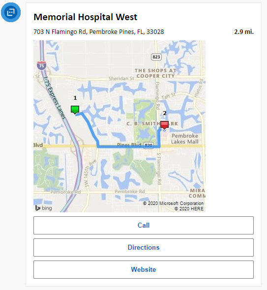
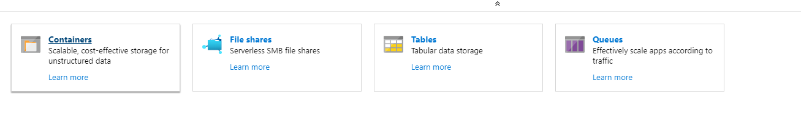
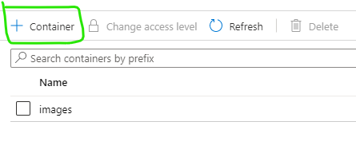
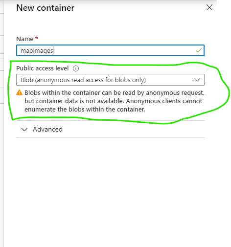
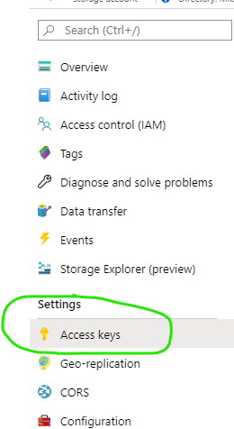
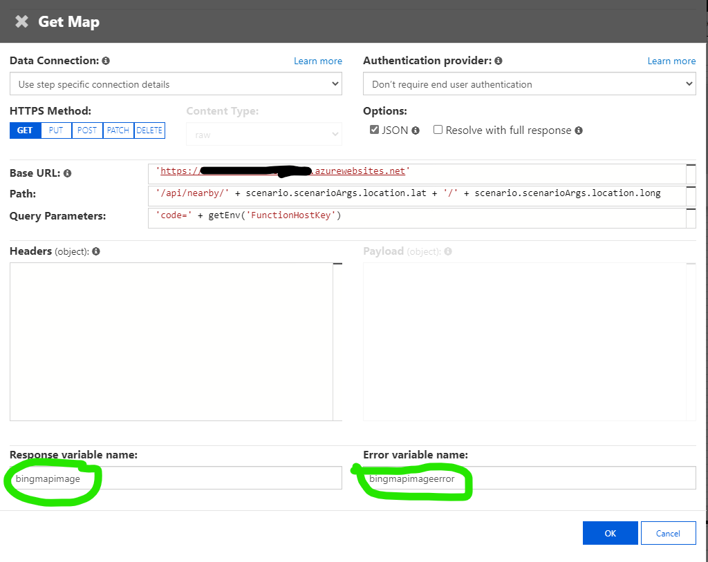
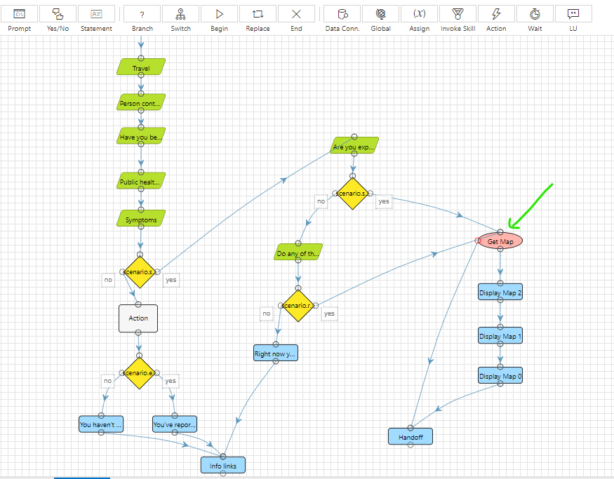
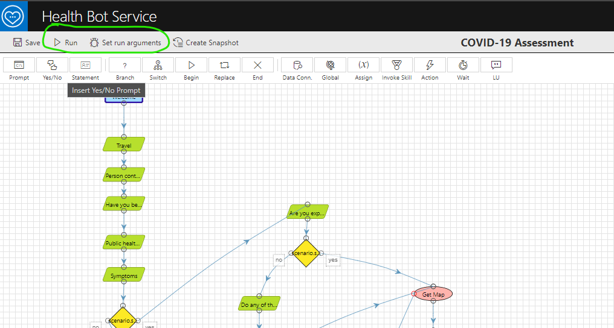

# COVID-19 Health Bot Location & Routing Services
This repo provides a solution that that was created as an added component for the Microsoft Health Bot COVID-19 Assessment.  The code base uses the Public APIs from [Bing](https://dev.virtualearth.net/). also a Custom Cosmos DB leveraging the geospatial search features  to provide the closest Hospitals & Care centers for those who are considered High Risk after taking the assessment in the bot.  The solution is an Azure Function that wraps the APIs to get the data needed for the the Adaptive Card [(See Sample)](#sample) in the Bot.

#### <a name="sample">Adaptive Card Sample</a>


## Problem
The [Microsoft Health Bot Service](https://docs.microsoft.com/en-us/HealthBot/quickstart-createyourhealthcarebot) provides a COVID-19 Assessment Template that can allow you to create a bot for people to self-assess themselves for COVID-19. Many hospital systems have hospitals and testing centers that they would like to redirect patients to for further screening if they are "High Risk" after taking the assessment. Currently OOB the Health Bot requires some coding to determine what locations to show to these users.  The solution in this repo addresses this problem.

## Solution
To address the problem I took a 2 pronged approach to the solution by providing searches for Hospitals via Bing using an Azure Functions Service which wraps the calls to get the hospital locations and return a map with a highlighted route to give the users an better idea of how close the destination is to their location as well as action buttons to Call, get Directions, and the Website for the destination. 

Secondly, there are those customers that wanted to only show their facilities so I created the use of Cosmos DB and leveraged the Geospatial features in the Cosmos DB service to get the "closest" facility in the list of custom facilities stored in Cosmos.  Once retrieved I query Bing to get a map and route information from the users current location.

The result is the Adaptive Card shown below.


## Dependencies
The solution in this repo will require an Azure Subscription with the following Services deployed:

1. [**Azure Function**](https://azure.microsoft.com/en-us/services/functions/) - this will be the main service used to return the location information for the Hospitals and/or Care Centers and will host the endpoints used in the final solution. 
1. [**Azure Blob Storage Account**](https://docs.microsoft.com/en-us/azure/storage/blobs/storage-blobs-introduction) - this is required to store the maps for the Bing Services with the highlighted routes when the Map APIs are called. A Public Anonymous blob container is needed to serve the map images.  
1. [**Microsoft Health Bot Service**](https://docs.microsoft.com/en-us/HealthBot/quickstart-createyourhealthcarebot) - This is the Health Bot Service that has the COVID-19 scenario template we are using for our bot.  
1. [**Health Bot Container**](https://github.com/Microsoft/HealthBotContainerSample) - the chat bot container which connects to our Health Bot Service.
1. **(Optional) [Bing Map API](http://dev.virtualearth.net/)** -  You will need a Bing Maps API Key to use the Bing Map services for your Azure Function.  You can follow the steps [here to acquire a key](https://www.microsoft.com/en-us/maps/create-a-bing-maps-key).
1. **(Optional) [Cosmos DB Service](https://docs.microsoft.com/en-us/azure/cosmos-db/introduction)** - The solution uses Cosmos DB as the data store for all _"Custom"_ locations you want to store on your own.  The solution uses the [geospatial query features in Cosmos DB](https://docs.microsoft.com/en-us/azure/cosmos-db/sql-query-geospatial-intro) to find the closest locations from your data set to the current user. 

## How to Deploy
COMING SOON

### Create Blob Container
Once all the services have been deployed you will need to create a container in your Azure Storage Account Blob store. Go to the Azure Portal and open the Storage account you will use for storing the map images.

1. Select "Container" 
1. Select "+ Container" to create a new container 
1. Make sure to select "Blob" as the permission level to protect the Blob but allow anonymous reads. 

**IMPORTANT:** Note the Account Name, Account Key, and the Container name you just created for this blob as you will need them below in the Application settings.  The Key can be found in the Keys section of the storage account settings: 



### Application Settings
Add the following Application Settings to your Azure Functions App after deployment:

1. **IPLocationUri** - the value of the API endpoint to get users location by IP.
2. **BingMapKey** - Bing Map API Key
1. **GoogleMapKey** - Google Map API Key
1. **BlobAccountKey** - Blob Account Key for the storage service to store images.
1. **BlobAccountName** - Account Name for the storage service to store images.
1. **BlobImageContainer** - Name of the image container for the storage service to store images.
1. **LocationsConnectionString** - Cosmos DB connection string for the custom locations 

## Usage
Once the Azure Function solution is deployed there are three (3) main end points that will be of use:

### <a name=endpoints>Endpoints</a>
1. **Bing EndPoint** - located at **api/google/{lat}/{long}** will leverage the [Bing Map APIs](https://dev.virtualearth.net/).  You will need to have a Bing Maps Key configured in the Application Settings for the Azure Function.
1. **Custom (Cosmos DB) EndPoint** - located at **api/custom/{lat}/{long}** will use the Cosmos DB geospatial features to find the closest locations in your own private data set of locations. 
1. **Custom Location Find By Zip** - located at **api/zip/{zipCode}** will lookup the closest locations based on the zipCode parameter passed.  Leverages the above End Point once the lat/long of the Zip code is retrieved from Bing 

Once you have the code deployed you can just call these end points with the **_Latitude {lat} & Longitude {long}_** parameters from your Health Bot scenario using the [Data Connection](https://docs.microsoft.com/en-us/HealthBot/scenario-authoring/advanced_functionality#data-connections) functionality.  

<a name="dataconnection">Data Connection</a>


1. Replace the Base URL with your Azure Function URL
1. Update the Path with the proper endpoint path from the ones noted [above](#endpoints).
  1. **_NOTE:_** the parameters for {lat} & {long} will be available in the Health Bot using the _scenario.scenarioArgs.location_ object so no need to change this part if you follow the steps below when modifying your chat bot.
1. **IMPORTANT:** The Response variable names can be modified but keep the names in mind as you will need them later when you implement the Adaptive Map card. (Green Circles in the image above).

## Modify your Helath Bot Container & Scenario
Once this solution is deployed into Azure you will have to modify the COVID-19 Assessment Scenario to call this backend and get the data for the locations using one of the three options outlined above in the [Endpoints section](#endpoints). 

Optionally, We also have to update the [Health Bot Container Sample](https://github.com/livehands/HealthBotContainerSample) after deployment of the chat bot to leverage the IP based location service as a fallback if the user denies using their location. as the user's lat/long coordinates are needed for this service to work properly.  

**_NOTE:_** I say the above paragraph is optional as I want to leave the option open in case you have Privacy concerns when using hte IP for location, if the user declines to share the location however via the HTML5 Geolocation API then the cards will not show in the bot.  

### Modify the COVID-19 Scenario
Once this Azure Functions service is deployed we can use it in our Health Bot Scenario.  In order to leverage this we are going to add a [Data Connection](https://docs.microsoft.com/en-us/HealthBot/scenario-authoring/advanced_functionality#data-connections) to the scenario. In my final scenario I add this data connection to the path for ONLY the COVID-19 High Risk path in the scenario just before the "Handoff" task (see Green Arrow):



Here I add the [Data Connection](https://docs.microsoft.com/en-us/HealthBot/scenario-authoring/advanced_functionality#data-connections) and connect the two yellow decision tasks "Yes" option to the Map as at this point the user is considered "High Risk". You can add this to any location you like.  I then configure the Data Connection as specified above in the [Data Connection Section](#dataconnection).

I also added statement activities (3) after the data connection call to show my [Adaptive Card](https://docs.microsoft.com/en-us/adaptive-cards/).  The code for the adaptive card can be found in the AdaptiveCardTemplate folder of this repo. 

1. Add a Statement Activity to the Scenario
  1. Connect the Success point of the Data Connection you added above to the statement.
  1. Connect the Output of the statement to the Handoff statement activity. 
1. Edit the Statement Activity you just added and in the dialog select "Edit Cards".
  1. Click "Add Card" in the next Dialog
  1. Copy the contents of the MapCard.json file from the AdaptiveCardsTemplate Folder into the Adaptive Card Editor.
1. Repeat steps above 2 more times and update index values in the Adaptive Card editor to reflect the correct item in the returned list.

Your scenario should look like the following, not all the items below the Green Arrow:


  **_NOTE_**: The variable name for each element should match the "Response Variable Name" from the Data Connection activity.  In my case this is "bingmapimage".  Also remember the Azure Function returns an array (list) of locations so you need to use the proper index value in the card to show to correct item.

##### Test
You can test this is working by running the scenario in the Health Bot Scenario debugger.  You will need to set the location run arguments to simulate the passing of the users location.  Here is a sample JSON to use for the run arguments, just paste this into your "Set Run Arguments" & Save:

``` JSON
{
 "location": {
 "lat": "47.639881",
 "long": "-122.124382"
 }
}
```

You should answer YES to all the questions in the scenario and then the Maps should show before the last step in your scenario (if you placed the Displays in the same place I did!)



### Modify Chat Container to get IP Location
The last and final step to getting this all working is to add some code to the chat bot container so that you can get the user's location weather or not they give permission.  [The official repo for the Chat Bot is located here](https://github.com/Microsoft/HealthBotContainerSample).  

I have forked this repo and added the code needed to leverage the IP to get user location, you can [Clone My repo here](https://github.com/livehands/HealthBotContainerSample) to get the chat bot in a Ready to go format. 


Deploy this to an Azure website as specified in the repo.  Once complete you will need to update line 3 of the code to use your endpoint to get the users location by IP: 

``` javascript
const ipLocationLookupEndpoint = "<YOUR FUNCTION LOCATION IP ENDPOINT>";
```

#### Difference between My Fork & the OFFICIAL Repo
I added/modified the "getUserLocation(callback)" & "getUserLocationIp(callback)" functions to the my forked repo to enable the capabilities in this solution.  Here is the code snippet that changed.

``` javascript
function getUserLocation(callback) {
    navigator.geolocation.getCurrentPosition(
        function(position) {
            var latitude  = position.coords.latitude;
            var longitude = position.coords.longitude;
            var location = {
                lat: latitude,
                long: longitude
            }
            callback(location);
        },
        function(error) {
            // user declined to share location
            console.log("location error:" + error.message);

            // Get Location via IP
            getUserLocationIp(callback);

            //callback();
        });
}

function getUserLocationIp(callback) {
    const oReq = new XMLHttpRequest();

    oReq.open("GET", ipLocationLookupEndpoint, true);

    oReq.onload = function () {
        var position = JSON.parse(this.response);
        console.log("IP Position: " + JSON.stringify(position));
        if (oReq.status >= 200 && oReq.status <= 400) {
            var latitude = position.lat;
            var longitude = position.lon;
            var location = { lat: latitude, long: longitude };
            callback(location);
        }
        else {
            callback();
        }
    }

    oReq.send();
}

```

#### OFFICIAL REPO BUG FIX: Location not Sent to BOT Bug in Official Repo
If you chose to use the official repo to deploy the chat bot container there is one last bug that I am working to get included back to the official repo is the actually pass the user's lat/long to the bot.  The following code is currently missing from the OFFICIAL REPO & needs to be added to the "initBotConversation()" function pass the location.

``` javascript
    let location = undefined;
    
    if(tokenPayload.location) {
        location = tokenPayload.location;
    }
```

Here is the full context of where this code should be added:

``` javascript
let domain = undefined;
    if (tokenPayload.directLineURI) {
        domain =  "https://" +  tokenPayload.directLineURI + "/v3/directline";
    }

    let location = undefined;
    if(tokenPayload.location) {
        location = tokenPayload.location;
    }

    var botConnection = window.WebChat.createDirectLine({
        token: tokenPayload.connectorToken,
        domain: domain
    });
```

## THAT'S ALL FOLKS!!  
The notes below should help if you need to modify things for your use but this should get you started.

# Notes
## User Location Acquisition 
In order for the Location Services in this repo to work we have to acquire the user's location from the Health Bot Container.  The [Health Bot Container Sample](https://github.com/livehands/HealthBotContainerSample) has code that leverages the geolocation API, a HTML5 feature, that allows a web page’s visitor to share their location with you **if they so choose**. The key statement being **if they so choose** hence, the issue is the user has to give us permission to their location. If they don't give permission then the chat bot cannot acquire the user's location and the calls to the geolocation API services will not provide what we need. Secondly, if the user is using an older browser, like say Opera or IE 10, the geolocation API is not available and you won't be able to acquire the location in this situation either.  

The solution that I provide here is the "LocationViaIP" endpoint in the function.  My solution was using [IP Geolocation API](http://ip-api.com) because it did not require me to sign up and is open.  The issue with this API I found when I tried to use it from the [Health Bot Container Sample](https://github.com/livehands/HealthBotContainerSample) is that it does not have an *"HTTPS"* access point and I got an error about a "Mixed protocol usage" not being allowed in my browser.  So I decided to create a wrapper that will provide a HTTPS endpoint via my function.  When deployed as coded here will show up a the endpoint **"https://<your-function-name>.azurewebsites.net/api/locationip"** 

**UPDATE:** The code has been update to use the [GeoLocation DB](http://geolocation-db.com/) API instead as the terms for IP Geolocation API Required a license to perform the operations we need in the bot!

### IP Location Services
In my research I found 3 IP Geolocation services that seemed to be the most popular.  You can certainly use your own for this purpose just be aware that you might have to update you client side code to read the values as some APIs return the location as "lat"/"long" and others use "latitude"/"longitude".  I will point this out below in the section on modifying your bot container.

Here are the three APIs I found.  To get a good understanding of how to use this services, read their documentation and modify the LocationViaIP function accordingly.:

1. [GeoLocation DB](http://geolocation-db.com/) Open & seems FREE as no license information is available on the site.  No sign up required.
1. [IP Geolocation API](http://ip-api.com) - Open and Free of non-commercial use. No sign up required. If you exceed the usage limit of 45 requests per minute your access to the API will be temporarily blocked. Repeatedly exceeding the limit will result in your IP address being banned for up to 1 hour. [See the Terms](https://ip-api.com/docs/legal)
1. [IPinfo](https://ipinfo.io) - Account required Free usage of the API is limited to 50,000 API requests per month.

## Customization
There are a couple of areas where this code can be quickly adjusted to return a different Category of locations and/or adjust the number of search results returned by the service.

#### Returning Different Location Categories
While this code was used to provide a backend service for the Health Bot Service it also serves as a sample for any other bot or application framework that need a similar backend.  The repo uses hard coded values "Hospitals" when querying Google & Bing. You could parameterize further to provide search results from other categories and/or queries pretty quickly by modifying the BingHelper.cs and GoogleHelper.cs files to work the way you would like. 

#### Number of Items Returned
Secondly, the solution also only returns the 3 closest locations.  I chose 3 due to the chat bot interface as I didn't want my users having the scroll through too many items.  This too can be parameterized to return your desired # of locations. by modifying the ILocationApi.cs interface to use another default or adjust the concrete implementations of the BingHelper and Google Helper classes to use a different default and/or parameter value.  
